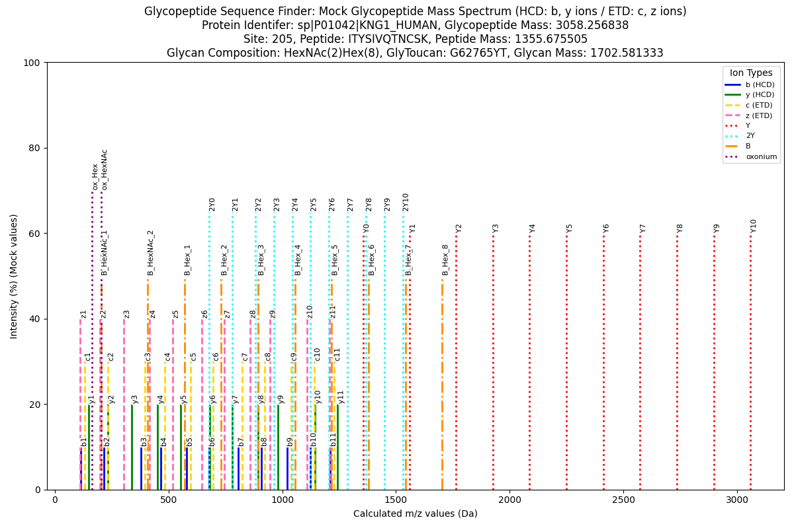
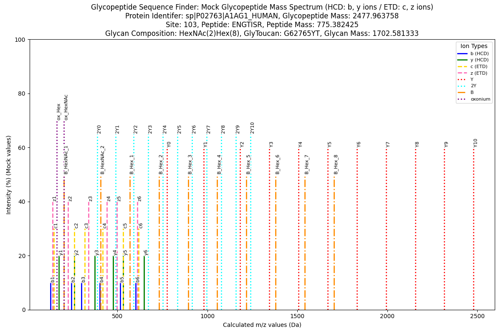

# Glycopeptide_Sequence_Finder

17JAN2025 -- Richard Shipman

## Overview

Welcome to the Glycopeptide Sequence Finder!



*Example above*: Calculated mass spectrum for glycopeptide Kininogen-1 (P01042) KNG1_HUMAN - ITYSIVQTNCSK - 205 - G62765YT - HexNAc(2)Hex(8) created `plot_mock_mass_spectra.py`. Note: This is a basic N-glycan structure fragment under are minimum sequential fragmentation of Hex(8) down to HexHAc(2) core N-glycan.

**Glycopeptide Sequence Finder** is a Python script that processes protein sequences from a FASTA file to find amino acid sequences which may or may not contain the post-translational modification glycosylation, the attachment of glycans (polysaccharides) to protein sequences. It uses user-specified proteases to digest and cleave protein sequences into amino acid sequences. The script then identifies N-linked glycopeptides using glycosylation sequon (motifs) like the N-sequon “N[^P][STC]” (NX[STC], where X is not P), O-sequon "[S/T"], or C-sequon "W..[WCF]". It calculates the properties of these glycopeptides, including mass, hydrophobicity, and glycosylation sites. Additionally, the script gathers information from the inputted FASTA file to create a predicted digested glycopeptide (peptide sequence backbone) library. The output is written to a CSV file, making it easy to integrate into downstream analyses.

Additionally, a directory containing proteomics related info is stored in a directory titled `digested_peptide_library' for other use cases. This may be expanded in the future for other needs

I am currently developing a basic calculation tool for fragment ions of high mannose N-glycans to simulate the fragmentation behavior of N-glycopeptides under HCD (High-Energy Collisional Dissociation) conditions. That is the image used above of a mock mass spectrum. This tool is designed to provide a fundamental outline of N-glycopeptide fragmentation, focusing on the generation of fragment ions typically observed in mass spectrometry experiments.

As part of the project, I am also integrating a plotting utility that visualizes the calculated mock fragment ion values, allowing for the comparison of the theoretical results against the mass spectrum data. This enables a clearer understanding of how glycopeptides and their glycans fragment during analysis.

For ease of experimentation and reproducibility, all data used in the calculations and plots, including example glycopeptides and their corresponding glycan compositions, are provided in organized folders. This setup allows for quick reference and testing of different theoretical models and fragmentation pathways.

*Note*: This project is for fun and more of an exploration of glycoprotoemic space in silico. Who know where this may lead.

# Table of Contents

[Overview](#overview)

[Requirements](#requirements)

[Installation](#installation)

[Usage](#usage)

### Reference Materials

[License](#license)

[Acknowledgments](#acknowledgments)

[Appendix](#appendix)
    - [Log File Details](#log-file)
    - [Test Proteomes List](#test-proteomes)
    - [Glycan Mass Library](#glycan-mass-library)

## Features

1. **Protease-Specific Cleavage:**
    - Supports several commonly used proteases, including:
        - **Trypsin:** Cleaves after K or R, except if followed by P.
        - **Chymotrypsin:** Cleaves after F, W, or Y, except if followed by P.
        - **Glu-C:** Cleaves after E.
        - **Lys-C:** Cleaves after K.
        - **Arg-C:** Cleaves after R.
        - **Asp-N:** Cleaves before D.
        - **Pepsin:** Cleaves after F, L, W, or Y.
        - **Proteinase K:** Cleaves after A, F, I, L, V, W, or Y.
        - **All:** Runs all proteases above.
2. **Missed Cleavages:**
    - Allows specifying the number of missed cleavages to simulate incomplete digestion.
3. **Glycosylation Type:** 
    - Select from N-linked (N), O-linked (O), or C-linked (C) glycopeptides. (Adjust or add sequon)
        - **N-linked:** N-sequon “N[^P][STC]"
        - **O-linked:** O-sequon “[ST]" 
        - **C-linked:** C-sequon "W..[WCF]"
3. **Peptide Property Calculation:**
    - Calculates peptide mass, hydrophobicity, isoelectric point (pI), charge states m/z values, and N-glycan ion fragmentation series (experimental).

## Requirements

- Python 3.7 or later
- Libraries:
    - argparse
    - csv
    - re
    - biopython

## Installation

Install the required Python libraries using pip:

```sh
pip install argparse biopython pandas
```

## Usage

Run the script from the command line with the following arguments:

```sh
python glycopeptide_finder_cmd.py -i <input_fasta> [-o <output_csv>] [-p <protease>] [-g <glycosylation>] [-c <missed_cleavages>] [-l <log.txt>] [-v]
```

### Arguments

- `-i`, `--input` (required): Path to the input FASTA file.
- `-o`, `--output` (optional): Path to the output CSV file. If omitted, a default name is generated.
- `-p`, `--protease` (optional): Protease to use for cleavage. Default is trypsin.
- `-g`, `--glycosylation` (optional): Glycosylation sequon to find in peptides. Default is N-linked. (N, O, C) Warning when using O or C, experimental.
- `-c`, `--missed_cleavages` (optional): Number of missed cleavages allowed. Default is 0.
- `-l log.txt`, `--log log.txt` (optional): Path to the log file. If omitted, logging is disabled.
- `-v`, `--verbose` (optional): Enable verbose output. Default is False.
- `-y`, `--glycan`: Path to the glycan file (CSV format) (Default, 4 glycans stored in file). 
- `-z`, `--charge`: (Optional) Maximum charge state to compute (default: 5).

### Example

```sh
python glycopeptide_finder_cmd.py -i test_proteomes/human_uniprotkb_proteome_UP000005640_AND_revi_2025_01_17.fasta -p trypsin -g N -c 0 -z 3
```

The output file will be dynamically named:

`example_predicted_trypsin_glycopeptides.csv`

### Example CSV Content

```CSV
ProteinID,Site,GlyToucan_AC,Composition,Peptide,Start,End,Length,Sequon,GlycopeptideMass,PeptideMass,GlycanMass,Hydrophobicity,pI,Protease,GlycosylationType,MissedCleavages,GeneName,z2,IonSeries
sp|A0A087X1C5|CP2D7_HUMAN,416.0,G62765YT,HexNAc(2)Hex(8),GTTLITNLSSVLK,410.0,422.0,13.0,NLS,3048.3629979999996,1345.7816649999997,1702.581333,0.66154,10.07,,,,CYP2D7,1525.1887749999999,"{'b': [58.0287, 159.0764, 260.1241, 373.2082, 486.2922, 587.3399, 701.3828, 814.4669, 901.4989, 988.5309, 1087.5994, 1200.6834], 'y': [1289.7675, 1188.7198, 1087.6721, 974.5881, 861.504, 760.4563, 646.4134, 533.3293, 446.2973, 359.2653, 260.1969, 147.1128], 'Y': {'Y0': 1346.7889, 'Y1': 1549.8683, 'Y2': 1752.9477, 'Y3': 1915.0005, 'Y4': 2077.0533, 'Y5': 2239.1061, 'Y6': 2401.1589, 'Y7': 2563.2117, 'Y8': 2725.2645, 'Y9': 2887.3173, 'Y10': 3049.3701}, 'B': {'B_HexNAc_1': 204.0867, 'B_HexNAc_2': 407.1661, 'B_Hex_1': 569.2189, 'B_Hex_2': 731.2717, 'B_Hex_3': 893.3245, 'B_Hex_4': 1055.3773, 'B_Hex_5': 1217.4301, 'B_Hex_6': 1379.4829, 'B_Hex_7': 1541.5357, 'B_Hex_8': 1703.5885}, 'oxonium': {'ox_HexNAc': 204.0867, 'ox_Hex': 163.0601}}"
sp|A0A0K2S4Q6|CD3CH_HUMAN,100.0,G62765YT,HexNAc(2)Hex(8),SDQVIITDHPGDLTFTVTLENLTADDAGK,80.0,108.0,29.0,NLT,4788.090428000001,3085.509095000001,1702.581333,-0.22759,3.45,,,,CD300H,2395.0524900000005,"{'b': [88.0393, 203.0662, 331.1248, 430.1932, 543.2773, 656.3614, 757.409, 872.436, 1009.4949, 1106.5476, 1163.5691, 1278.596, 1391.6801, 1492.7278, 1639.7962, 1740.8439, 1839.9123, 1940.96, 2054.044, 2183.0866, 2297.1295, 2410.2136, 2511.2613, 2582.2984, 2697.3253, 2812.3523, 2883.3894, 2940.4108], 'y': [2999.4843, 2884.4574, 2756.3988, 2657.3304, 2544.2464, 2431.1623, 2330.1146, 2215.0877, 2078.0288, 1980.976, 1923.9545, 1808.9276, 1695.8435, 1594.7959, 1447.7275, 1346.6798, 1247.6114, 1146.5637, 1033.4796, 904.437, 790.3941, 677.31, 576.2624, 505.2253, 390.1983, 275.1714, 204.1343, 147.1128], 'Y': {'Y0': 3086.5164, 'Y1': 3289.5958, 'Y2': 3492.6752, 'Y3': 3654.728, 'Y4': 3816.7808, 'Y5': 3978.8336, 'Y6': 4140.8864, 'Y7': 4302.9392, 'Y8': 4464.992, 'Y9': 4627.0448, 'Y10': 4789.0976}, 'B': {'B_HexNAc_1': 204.0867, 'B_HexNAc_2': 407.1661, 'B_Hex_1': 569.2189, 'B_Hex_2': 731.2717, 'B_Hex_3': 893.3245, 'B_Hex_4': 1055.3773, 'B_Hex_5': 1217.4301, 'B_Hex_6': 1379.4829, 'B_Hex_7': 1541.5357, 'B_Hex_8': 1703.5885}, 'oxonium': {'ox_HexNAc': 204.0867, 'ox_Hex': 163.0601}}"
sp|A0A1B0GTW7|CIROP_HUMAN,333.0,G62765YT,HexNAc(2)Hex(8),ENCSTR,332.0,337.0,6.0,NCS,2410.867428,708.2860949999999,1702.581333,-1.75,6.21,,,,CIROP,1206.44099,"{'b': [130.0499, 244.0928, 347.102, 434.134, 535.1817], 'y': [580.2508, 466.2079, 363.1987, 276.1666, 175.119], 'Y': {'Y0': 709.2934, 'Y1': 912.3728, 'Y2': 1115.4522, 'Y3': 1277.505, 'Y4': 1439.5578, 'Y5': 1601.6106, 'Y6': 1763.6634, 'Y7': 1925.7162, 'Y8': 2087.769, 'Y9': 2249.8218, 'Y10': 2411.8746}, 'B': {'B_HexNAc_1': 204.0867, 'B_HexNAc_2': 407.1661, 'B_Hex_1': 569.2189, 'B_Hex_2': 731.2717, 'B_Hex_3': 893.3245, 'B_Hex_4': 1055.3773, 'B_Hex_5': 1217.4301, 'B_Hex_6': 1379.4829, 'B_Hex_7': 1541.5357, 'B_Hex_8': 1703.5885}, 'oxonium': {'ox_HexNAc': 204.0867, 'ox_Hex': 163.0601}}"
sp|A0A1B0GTW7|CIROP_HUMAN,425.0,G62765YT,HexNAc(2)Hex(8),DSGWYQVNHSAAEELLWGQGSGPEFGLVTTCGTGSSDFFCTGSGLGCHYLHLDK,418.0,471.0,54.0,NHS,7423.116007999999,5720.534674999999,1702.581333,-0.22037,4.27,,,,CIROP,3712.5652799999993,"{'b': [116.0342, 203.0662, 260.0877, 446.167, 609.2303, 737.2889, 836.3573, 950.4003, 1087.4592, 1174.4912, 1245.5283, 1316.5654, 1445.608, 1574.6506, 1687.7347, 1800.8187, 1986.898, 2043.9195, 2171.9781, 2228.9995, 2316.0316, 2373.053, 2470.1058, 2599.1484, 2746.2168, 2803.2382, 2916.3223, 3015.3907, 3116.4384, 3217.4861, 3320.4953, 3377.5167, 3478.5644, 3535.5859, 3622.6179, 3709.6499, 3824.6769, 3971.7453, 4118.8137, 4221.8229, 4322.8706, 4379.892, 4466.924, 4523.9455, 4637.0296, 4694.051, 4797.0602, 4934.1191, 5097.1825, 5210.2665, 5347.3254, 5460.4095, 5575.4364], 'y': [5606.515, 5519.483, 5462.4615, 5276.3822, 5113.3189, 4985.2603, 4886.1919, 4772.149, 4635.0901, 4548.058, 4477.0209, 4405.9838, 4276.9412, 4147.8986, 4034.8146, 3921.7305, 3735.6512, 3678.6297, 3550.5712, 3493.5497, 3406.5177, 3349.4962, 3252.4434, 3123.4009, 2976.3324, 2919.311, 2806.2269, 2707.1585, 2606.1108, 2505.0632, 2402.054, 2345.0325, 2243.9848, 2186.9634, 2099.9313, 2012.8993, 1897.8724, 1750.804, 1603.7355, 1500.7264, 1399.6787, 1342.6572, 1255.6252, 1198.6037, 1085.5197, 1028.4982, 925.489, 788.4301, 625.3668, 512.2827, 375.2238, 262.1397, 147.1128], 'Y': {'Y0': 5721.542, 'Y1': 5924.6214, 'Y2': 6127.7008, 'Y3': 6289.7536, 'Y4': 6451.8064, 'Y5': 6613.8592, 'Y6': 6775.912, 'Y7': 6937.9648, 'Y8': 7100.0176, 'Y9': 7262.0704, 'Y10': 7424.1232}, 'B': {'B_HexNAc_1': 204.0867, 'B_HexNAc_2': 407.1661, 'B_Hex_1': 569.2189, 'B_Hex_2': 731.2717, 'B_Hex_3': 893.3245, 'B_Hex_4': 1055.3773, 'B_Hex_5': 1217.4301, 'B_Hex_6': 1379.4829, 'B_Hex_7': 1541.5357, 'B_Hex_8': 1703.5885}, 'oxonium': {'ox_HexNAc': 204.0867, 'ox_Hex': 163.0601}}"
sp|A0A1B0GTW7|CIROP_HUMAN,491.0,G62765YT,HexNAc(2)Hex(8),MYKPLANGSECWK,485.0,497.0,13.0,NGS,3228.2870780000003,1525.705745,1702.581333,-0.75385,8.76,,,,CIROP,1615.1508150000002,"{'b': [132.0478, 295.1111, 423.2061, 520.2588, 633.3429, 704.38, 818.4229, 875.4444, 962.4764, 1091.519, 1194.5282, 1380.6075], 'y': [1395.6725, 1232.6092, 1104.5142, 1007.4615, 894.3774, 823.3403, 709.2974, 652.2759, 565.2439, 436.2013, 333.1921, 147.1128], 'Y': {'Y0': 1526.713, 'Y1': 1729.7924, 'Y2': 1932.8718, 'Y3': 2094.9246, 'Y4': 2256.9774, 'Y5': 2419.0302, 'Y6': 2581.083, 'Y7': 2743.1358, 'Y8': 2905.1886, 'Y9': 3067.2414, 'Y10': 3229.2942}, 'B': {'B_HexNAc_1': 204.0867, 'B_HexNAc_2': 407.1661, 'B_Hex_1': 569.2189, 'B_Hex_2': 731.2717, 'B_Hex_3': 893.3245, 'B_Hex_4': 1055.3773, 'B_Hex_5': 1217.4301, 'B_Hex_6': 1379.4829, 'B_Hex_7': 1541.5357, 'B_Hex_8': 1703.5885}, 'oxonium': {'ox_HexNAc': 204.0867, 'ox_Hex': 163.0601}}"
sp|A0A1B0GTW7|CIROP_HUMAN,524.0,G62765YT,HexNAc(2)Hex(8),CFFANLTSQLLPGDKPR,520.0,536.0,17.0,NLT,3608.558408,1905.9770749999998,1702.581333,-0.15882,8.86,,,,CIROP,1805.28648,"{'b': [104.0165, 251.0849, 398.1533, 469.1904, 583.2333, 696.3174, 797.3651, 884.3971, 1012.4557, 1125.5397, 1238.6238, 1335.6766, 1392.698, 1507.725, 1635.8199, 1732.8727], 'y': [1803.9752, 1656.9068, 1509.8383, 1438.8012, 1324.7583, 1211.6742, 1110.6266, 1023.5945, 895.536, 782.4519, 669.3678, 572.3151, 515.2936, 400.2667, 272.1717, 175.119], 'Y': {'Y0': 1906.9844, 'Y1': 2110.0638, 'Y2': 2313.1432, 'Y3': 2475.196, 'Y4': 2637.2488, 'Y5': 2799.3016, 'Y6': 2961.3544, 'Y7': 3123.4072, 'Y8': 3285.46, 'Y9': 3447.5128, 'Y10': 3609.5656}, 'B': {'B_HexNAc_1': 204.0867, 'B_HexNAc_2': 407.1661, 'B_Hex_1': 569.2189, 'B_Hex_2': 731.2717, 'B_Hex_3': 893.3245, 'B_Hex_4': 1055.3773, 'B_Hex_5': 1217.4301, 'B_Hex_6': 1379.4829, 'B_Hex_7': 1541.5357, 'B_Hex_8': 1703.5885}, 'oxonium': {'ox_HexNAc': 204.0867, 'ox_Hex': 163.0601}}"
sp|A0A1B0GTW7|CIROP_HUMAN,713.0,G62765YT,HexNAc(2)Hex(8),KPLEVYHGGANFTTQPSK,703.0,720.0,18.0,NFT,3675.581978,1973.0006449999998,1702.581333,-0.91111,9.63,,,,CIROP,1838.7982650000001,"{'b': [129.1022, 226.155, 339.2391, 468.2816, 567.3501, 730.4134, 867.4723, 924.4938, 981.5152, 1052.5523, 1166.5953, 1313.6637, 1414.7113, 1515.759, 1643.8176, 1740.8704, 1827.9024], 'y': [1845.913, 1748.8602, 1635.7761, 1506.7336, 1407.6651, 1244.6018, 1107.5429, 1050.5214, 993.5, 922.4629, 808.4199, 661.3515, 560.3039, 459.2562, 331.1976, 234.1448, 147.1128], 'Y': {'Y0': 1974.0079, 'Y1': 2177.0873, 'Y2': 2380.1667, 'Y3': 2542.2195, 'Y4': 2704.2723, 'Y5': 2866.3251, 'Y6': 3028.3779, 'Y7': 3190.4307, 'Y8': 3352.4835, 'Y9': 3514.5363, 'Y10': 3676.5891}, 'B': {'B_HexNAc_1': 204.0867, 'B_HexNAc_2': 407.1661, 'B_Hex_1': 569.2189, 'B_Hex_2': 731.2717, 'B_Hex_3': 893.3245, 'B_Hex_4': 1055.3773, 'B_Hex_5': 1217.4301, 'B_Hex_6': 1379.4829, 'B_Hex_7': 1541.5357, 'B_Hex_8': 1703.5885}, 'oxonium': {'ox_HexNAc': 204.0867, 'ox_Hex': 163.0601}}"
sp|A0AV02|S12A8_HUMAN,221.0,G62765YT,HexNAc(2)Hex(8),LQLLLLFLLAVSTLDFVVGSFTHLDPEHGFIGYSPELLQNNTLPDYSPGESFFTVFGVFFPAATGVMAGFNMGGDLR,182.0,258.0,77.0,NNT,10055.775277999997,8353.193944999997,1702.581333,0.56494,3.77,,,,SLC12A8,5028.894914999999,"{'b': [114.0913, 242.1499, 355.234, 468.318, 581.4021, 694.4862, 841.5546, 954.6386, 1067.7227, 1138.7598, 1237.8282, 1324.8602, 1425.9079, 1538.992, 1654.0189, 1801.0873, 1900.1557, 1999.2241, 2056.2456, 2143.2776, 2290.346, 2391.3937, 2528.4526, 2641.5367, 2756.5636, 2853.6164, 2982.659, 3119.7179, 3176.7394, 3323.8078, 3436.8918, 3493.9133, 3656.9766, 3744.0086, 3841.0614, 3970.104, 4083.1881, 4196.2721, 4324.3307, 4438.3736, 4552.4166, 4653.4642, 4766.5483, 4863.6011, 4978.628, 5141.6913, 5228.7234, 5325.7761, 5382.7976, 5511.8402, 5598.8722, 5745.9406, 5893.009, 5994.0567, 6093.1251, 6240.1935, 6297.215, 6396.2834, 6543.3518, 6690.4202, 6787.473, 6858.5101, 6929.5472, 7030.5949, 7087.6163, 7186.6847, 7317.7252, 7388.7623, 7445.7838, 7592.8522, 7706.8951, 7837.9356, 7894.9571, 7951.9785, 8067.0055, 8180.0895], 'y': [8241.1172, 8113.0586, 7999.9745, 7886.8905, 7773.8064, 7660.7223, 7513.6539, 7400.5699, 7287.4858, 7216.4487, 7117.3803, 7030.3483, 6929.3006, 6816.2165, 6701.1896, 6554.1212, 6455.0528, 6355.9844, 6298.9629, 6211.9309, 6064.8625, 5963.8148, 5826.7559, 5713.6718, 5598.6449, 5501.5921, 5372.5495, 5235.4906, 5178.4691, 5031.4007, 4918.3167, 4861.2952, 4698.2319, 4611.1999, 4514.1471, 4385.1045, 4272.0204, 4158.9364, 4030.8778, 3916.8349, 3802.7919, 3701.7443, 3588.6602, 3491.6074, 3376.5805, 3213.5172, 3126.4851, 3029.4324, 2972.4109, 2843.3683, 2756.3363, 2609.2679, 2462.1995, 2361.1518, 2262.0834, 2115.015, 2057.9935, 1958.9251, 1811.8567, 1664.7883, 1567.7355, 1496.6984, 1425.6613, 1324.6136, 1267.5922, 1168.5238, 1037.4833, 966.4462, 909.4247, 762.3563, 648.3134, 517.2729, 460.2514, 403.23, 288.203, 175.119], 'Y': {'Y0': 8354.2012, 'Y1': 8557.2806, 'Y2': 8760.36, 'Y3': 8922.4128, 'Y4': 9084.4656, 'Y5': 9246.5184, 'Y6': 9408.5712, 'Y7': 9570.624, 'Y8': 9732.6768, 'Y9': 9894.7296, 'Y10': 10056.7824}, 'B': {'B_HexNAc_1': 204.0867, 'B_HexNAc_2': 407.1661, 'B_Hex_1': 569.2189, 'B_Hex_2': 731.2717, 'B_Hex_3': 893.3245, 'B_Hex_4': 1055.3773, 'B_Hex_5': 1217.4301, 'B_Hex_6': 1379.4829, 'B_Hex_7': 1541.5357, 'B_Hex_8': 1703.5885}, 'oxonium': {'ox_HexNAc': 204.0867, 'ox_Hex': 163.0601}}"
sp|A0AV02|S12A8_HUMAN,561.0,G62765YT,HexNAc(2)Hex(8),SEGTQPEGTYGEQLVPELCNQSESSGEDFFLK,542.0,573.0,32.0,NQS,5207.132777999999,3504.5514449999996,1702.581333,-0.91875,3.39,,,,SLC12A8,2604.5736649999994,"{'b': [88.0393, 217.0819, 274.1034, 375.151, 503.2096, 600.2624, 729.305, 786.3264, 887.3741, 1050.4374, 1107.4589, 1236.5015, 1364.5601, 1477.6441, 1576.7125, 1673.7653, 1802.8079, 1915.8919, 2018.9011, 2132.9441, 2261.0026, 2348.0347, 2477.0773, 2564.1093, 2651.1413, 2708.1628, 2837.2054, 2952.2323, 3099.3007, 3246.3691, 3359.4532], 'y': [3418.5267, 3289.4841, 3232.4626, 3131.415, 3003.3564, 2906.3036, 2777.261, 2720.2396, 2619.1919, 2456.1286, 2399.1071, 2270.0645, 2142.0059, 2028.9219, 1929.8535, 1832.8007, 1703.7581, 1590.6741, 1487.6649, 1373.6219, 1245.5634, 1158.5313, 1029.4887, 942.4567, 855.4247, 798.4032, 669.3606, 554.3337, 407.2653, 260.1969, 147.1128], 'Y': {'Y0': 3505.5587, 'Y1': 3708.6381, 'Y2': 3911.7175, 'Y3': 4073.7703, 'Y4': 4235.8231, 'Y5': 4397.8759, 'Y6': 4559.9287, 'Y7': 4721.9815, 'Y8': 4884.0343, 'Y9': 5046.0871, 'Y10': 5208.1399}, 'B': {'B_HexNAc_1': 204.0867, 'B_HexNAc_2': 407.1661, 'B_Hex_1': 569.2189, 'B_Hex_2': 731.2717, 'B_Hex_3': 893.3245, 'B_Hex_4': 1055.3773, 'B_Hex_5': 1217.4301, 'B_Hex_6': 1379.4829, 'B_Hex_7': 1541.5357, 'B_Hex_8': 1703.5885}, 'oxonium': {'ox_HexNAc': 204.0867, 'ox_Hex': 163.0601}}"

```

## Protease Rules

The following proteases are supported:

| Protease      | Cleavage Rule                        |
|---------------|--------------------------------------|
| Trypsin       | After K or R, not P                  |
| Chymotrypsin  | After F, W, or Y, not P              |
| Glu-C         | After E                              |
| Lys-C         | After K                              |
| Arg-C         | After R                              |
| Asp-N         | Before D                             |
| Pepsin        | After F, L, W, or Y                  |
| Proteinase K  | After A, F, I, L, V, W, or Y         |
| All           | Runs all proteases above             |

## Glycosylation Type Rules

The following glycosylation types sequons (motifs) are supported:

| Glycosylation Type | Sequon Pattern |
|--------------------|----------------|
| N-linked           | N[^P][STC]     |
| O-linked           | [ST]           |
| C-linked           | W..[WCF]       |

## Glycan Library

The default glycan mass library is defined as a DataFrame containing a set of glycans with their respective compositions and masses. This library is used to calculate the properties of glycopeptides. Alter if you wish to change the glycan mass library in the script

```python
default_glycan_library = pd.DataFrame([
    #{"glytoucan_ac": "G80920RR", "byonic": "HexNAc(2)Hex(9) % 1864.634157", "composition": "HexNAc(2)Hex(9)", "mass": 1864.634157}, # N2H9
    {"glytoucan_ac": "G62765YT", "byonic": "HexNAc(2)Hex(8) % 1702.581333", "composition": "HexNAc(2)Hex(8)", "mass": 1702.581333}, # N2H8
    #{"glytoucan_ac": "G31852PQ", "byonic": "HexNAc(2)Hex(7) % 1540.528510", "composition": "HexNAc(2)Hex(7)", "mass": 1540.528510}, # N2H7
    #{"glytoucan_ac": "G41247ZX", "byonic": "HexNAc(2)Hex(6) % 1378.475686", "composition": "HexNAc(2)Hex(6)", "mass": 1378.475686}, # N2H6
])
```

Other libraries in file. Feel free to expand to meet needs of user.

This DataFrame includes the following columns:
- `glytoucan_ac`: The glycosylation context identifier.
- `byonic`: The peptide sequence and mass in Byonic format.
- `composition`: The glycan composition.
- `mass`: The mass of the glycan.

The default glycan mass library can be expanded or customized as needed for specific analyses.

### Example glycan mass library data

This data is stored in the `glycan_mass_library` directory.

```csv
glytoucan_ac,byonic,composition,mass
G62765YT,HexNAc(2)Hex(8) % 1702.581333,HexNAc(2)Hex(8),1702.581333
G31852PQ,HexNAc(2)Hex(7) % 1540.528510,HexNAc(2)Hex(7),1540.528510
G41247ZX,HexNAc(2)Hex(6) % 1378.475686,HexNAc(2)Hex(6),1378.475686
```

# Plot Mock Mass Spectrum



plot_mock_mass_spectra.py

### *Usage Guide*

*This script generates mock mass spectrum plots from glycopeptide ion series stored in a CSV file. It processes ion series data, assigns colors to different ion types, computes ion numbers, and generates labeled mass spectrum plots.*

- Ion labels are automatically assigned based on their types.
- If a peptide sequence exceeds 50 characters, it will be skipped.
- The script ensures unique filenames for each output image.

#### Arguments:

- `-i, --input` (required): Path to the input CSV file containing glycopeptide ion series data.
- `-o, --output` (optional): Directory to save the generated plots (default: `mock_mass_spectra` directory).

### Input CSV Format

The CSV file must contain the following required columns:

- `IonSeries`: Dictionary-like string containing ion data (b, y, Y, B, oxonium).
- `ProteinID`: Identifier for the protein.
- `Peptide`: Peptide sequence.
- `Composition`: Glycan composition.
- `GlyToucan_AC`: GlyToucan accession number.

```bash
python script.py -i digested_glycopeptide_library/pig_uniprotkb_proteome_UP000008227_AND_revi_2025_02_01_trypsin_digested_mc0_z2_N-glycopeptides.csv
```

This will process `example_data.csv` and save the mass spectrum plots in the `results/` directory.

## Create Glycan Mass Library 

create_glycan_library.py

This script processes glycan data from a CSV file and splits it into columns based on specific formatting rules.

## Overview
The script takes an input CSV file with glyc肽 data formatted in two columns:
1. **glytoucan_ac**: A string representing the glycosylation context.
2. **byonic** / **byonic_sequence**: A composite column containing two pieces of information separated by a '%' character:
    - The peptide sequence (composition).
    - A numerical value representing mass.

The script splits the `byonic` column into its constituent parts, creating three new columns in the output file:
1. **glytoucan_ac**: The glycosylation context.
2. **composition**: The peptide sequence.
3. **mass**: The numerical mass value.

## Key Features

### Input File Format
The input CSV file must have exactly two columns per row, with the second column formatted as `<peptide> % <mass>`.

Example:
```
"glytoucan_ac","sequence_byonic","name_source"
"G00002CF","Hex(2)NeuGc(2) % 956.29687423","G93218EI"
"G00009BX","HexNAc(2)Hex(2)dHex(1) % 894.33286578","G93579XB"
"G00012MO","HexNAc(1)Hex(3) % 707.248407805","G08590QR"
"G00012RZ","HexNAc(5)Hex(6)dHex(3)NeuAc(1) % 2734.99351197","G04784US"
"G00013MO","Hex(4) % 666.2218587","G90306QO"
"G00014MO","HexNAc(2)Hex(2) % 748.27495691","G53434XO"
"G00015MO","HexNAc(1)Hex(3) % 707.248407805","G08590QR"
"G00016MO","Hex(2) % 342.1162117","G90627TW"
"G00017IP","HexNAc(4)Hex(3)Sulpho(1) % 1396.44334021","G67486RJ"
"G00024MO","Hex(3) % 504.1690352","G39365VM"

```

### Output File Format
The output file will have three columns:
- The first column (`glytoucan_ac`) remains unchanged.
- The second column contains the peptide sequence from `byonic`.
- The third column contains the numerical mass value.

Example:
```
glytoucan_ac,byonic,name_source,composition,mass
G00002CF,Hex(2)NeuGc(2) % 956.29687423,G93218EI,Hex(2)NeuGc(2),956.29687423
G00009BX,HexNAc(2)Hex(2)dHex(1) % 894.33286578,G93579XB,HexNAc(2)Hex(2)dHex(1),894.33286578
G00012MO,HexNAc(1)Hex(3) % 707.248407805,G08590QR,HexNAc(1)Hex(3),707.248407805
G00012RZ,HexNAc(5)Hex(6)dHex(3)NeuAc(1) % 2734.99351197,G04784US,HexNAc(5)Hex(6)dHex(3)NeuAc(1),2734.99351197
G00013MO,Hex(4) % 666.2218587,G90306QO,Hex(4),666.2218587
G00014MO,HexNAc(2)Hex(2) % 748.27495691,G53434XO,HexNAc(2)Hex(2),748.27495691
G00015MO,HexNAc(1)Hex(3) % 707.248407805,G08590QR,HexNAc(1)Hex(3),707.248407805
G00016MO,Hex(2) % 342.1162117,G90627TW,Hex(2),342.1162117
G00017IP,HexNAc(4)Hex(3)Sulpho(1) % 1396.44334021,G67486RJ,HexNAc(4)Hex(3)Sulpho(1),1396.44334021
G00024MO,Hex(3) % 504.1690352,G39365VM,Hex(3),504.1690352
```

## Glycan Hydrophobicity Ranking

This script ranks glycans based on their adjusted hydrophobicity factor (HF). The analysis removes the peptide effect, computes a weighted HF score considering glycan frequency, and normalizes the adjusted HF values using Z-scores. The glycans are then ranked by their weighted adjusted HF. Note, more glycopeptide data is needed for this to hold any value, work in progress.

### Functions:

- `compute_adjusted_hf(df)`: Adjusts HF by removing the peptide effect.
- `compute_weighted_adjusted_hf(df)`: Normalizes the adjusted HF and computes a weighted HF based on glycan frequency.
- `count_glycan_frequency(df)`: Counts the frequency of each glycan in the dataset.
- `rank_glycans_by_hydrophobicity(input_csv, output_csv)`: Main function that processes the input CSV, computes the adjusted HF, and outputs the glycan ranking by hydrophobicity.

```sh
python script.py -i input_file.csv -o output_file.csv
```

Arguments:
- `-i`, `--input`: Input CSV file path (required).
- `-o`, `--output`: Output CSV file path (optional, defaults to `<input_file>_glycan_hydrophobicity_index.csv`).

The output CSV will contain glycans ranked by their weighted adjusted HF score.

## Glycopeptide Hydrophobicity Calculation

This script calculates hydrophobicity scores for glycopeptides based on peptide hydrophobicity and glycan composition. It takes as input a glycopeptide data file and a glycan hydrophobicity data file, then outputs the results to a CSV file. Note, more glycopeptide data is needed for this to hold any value, work in progress.

Usage

```sh
python script.py -i <glycopeptide_file> -gh <glycan_hf_file> -o <output_file>
```

Arguments:
- `-i`: Input file containing glycopeptide data (CSV).
- `-gh`: Input file containing glycan hydrophobicity data (CSV, optional if default is used).
- `-o`: Output file name (optional, defaults to `<input_file_name>_HF.csv`).

Workflow
	1.	Load glycopeptide and glycan hydrophobicity data.
	2.	Calculate hydrophobicity scores for each glycopeptide.
	3.	Save the results to a CSV file.

# Batch Processing Scripts

Shell scripts for batch processing.

## Batch Run for FASTA Processing

batch_glycopeptide_sequence_finder.sh

To process multiple FASTA files in parallel using all proteases, run the following command:

```sh
./batch_glycopeptide_sequence_finder.sh
```

Parameters can be adjusted in the shell script.

### Parameters

- `ls test_proteomes/*.fasta`: Lists all FASTA files in the `test_proteomes` directory.
- `xargs -I {} -P 4`: Executes the command in parallel with up to 4 processes. The `{}` is a placeholder for each file name.
- `python glycopeptide_finder_cmd.py`: The script to run for each FASTA file.
- `-i "{}"`: Specifies the input FASTA file, where `{}` is replaced by each file name.
- `-p all`: Uses all proteases for cleavage.
- `-g N`: Searches for N-linked glycosylation sequons.
- `-c 0`: Allows 0 missed cleavages.
- `-v`: Enables verbose output.

This command allows you to efficiently process multiple FASTA files in parallel, reducing the overall processing time.

## Merging CSV Files

The script includes a function to merge all CSV files from a specified directory into a single CSV file. This can be useful for consolidating the results of multiple digestions into one file for easier analysis.

```sh
python merge_digested_glycopeptide_library.py
```

## Dockerfile

- Docker Setup for Glycopeptide Sequence Finder

This section explains how to build and run the Docker container for the Glycopeptide Sequence Finder.

1. Build the Docker Image

To create the Docker image, run the following command in the directory containing your Dockerfile and requirements.txt:

```sh
docker build -t gsf .
```

This will:
	•	Use the official Python 3.10-slim image.
	•	Set /app as the working directory.
	•	Install dependencies from requirements.txt.
	•	Copy the glycopeptide_sequence_finder_cmd.py script into the container.
	•	Set the entrypoint so that the script can be executed with arguments.

2. Run the Docker Container

To execute the script with test data, use:

```sh
docker run --rm \
    -v "$(pwd)/test_proteomes:/app/test_proteomes" \
    -v "$(pwd)/output:/app/digested_glycopeptide_library" \
    gsf \
    -i test_proteomes/apple_uniprotkb_proteome_UP000290289_AND_revi_2025_02_04.fasta \
    -g N \
    -o digested_glycopeptide_library/test.csv \
    -p chymotrypsin \
    -c 0 \
    -v
```

Explanation of Flags:
	•	--rm → Removes the container after execution.
	•	-v "$(pwd)/test_proteomes:/app/test_proteomes" → Mounts the input FASTA files.
	•	-v "$(pwd)/output:/app/digested_glycopeptide_library" → Mounts the output directory.
	•	gsf → Runs the built image.
	•	-i → Specifies the input FASTA file.
	•	-g → Sets the glycosylation type (default: N).
	•	-o → Defines the output file.
	•	-p → Specifies the protease (e.g., chymotrypsin).
	•	-c → Defines the missed cleavages.
	•	-v → Enables verbose mode.

3. Access the Output

The output files will be saved in the mounted directory on your local machine:

```sh
ls output/digested_glycopeptide_library/
```

Your results should be inside output/digested_glycopeptide_library/test.csv.

## License

This script is released under the MIT License. 

## Acknowledgments

- The Hitchhiker’s Guide to Glycoproteomics.

Oliveira, Tiago, Morten Thaysen-Andersen, Nicolle Packer, and Daniel Kolarich. “The Hitchhiker’s Guide to Glycoproteomics.” Biochemical Society Transactions 49 (July 20, 2021). https://doi.org/10.1042/BST20200879.

- In Silico Platform for Prediction of N-, O- and C-Glycosites in Eukaryotic Protein Sequences.

Chauhan, Jagat Singh, Alka Rao, and Gajendra P. S. Raghava. “In Silico Platform for Prediction of N-, O- and C-Glycosites in Eukaryotic Protein Sequences.” PLoS ONE 8, no. 6 (June 28, 2013): e67008. https://doi.org/10.1371/journal.pone.0067008.

- Large-Scale Identification of N-Linked Intact Glycopeptides in Human Serum Using HILIC Enrichment and Spectral Library Search.

Shu, Qingbo, Mengjie Li, Lian Shu, Zhiwu An, Jifeng Wang, Hao Lv, Ming Yang, et al. “Large-Scale Identification of N-Linked Intact Glycopeptides in Human Serum Using HILIC Enrichment and Spectral Library Search.” Molecular & Cellular Proteomics : MCP 19, no. 4 (April 2020): 672–89. https://doi.org/10.1074/mcp.RA119.001791.

- Assessing the Hydrophobicity of Glycopeptides Using Reversed-Phase Liquid Chromatography and Tandem Mass Spectrometry.

Wang, Junyao, Aiying Yu, Byeong Gwan Cho, and Yehia Mechref. “Assessing the Hydrophobicity of Glycopeptides Using Reversed-Phase Liquid Chromatography and Tandem Mass Spectrometry.” Journal of Chromatography. A 1706 (September 13, 2023): 464237. https://doi.org/10.1016/j.chroma.2023.464237.

- Molecular Basis of C-Mannosylation – a Structural Perspective.

Crine, Samuel L., and K. Ravi Acharya. “Molecular Basis of C-Mannosylation – a Structural Perspective.” The FEBS Journal 289, no. 24 (2022): 7670–87. https://doi.org/10.1111/febs.16265.

- BioPython for handling FASTA files.

Cock, P. J., Antao, T., Chang, J. T., Chapman, B. A., Cox, C. J., Dalke, A., … others. (2009). Biopython: freely available Python tools for computational molecular biology and bioinformatics. Bioinformatics, 25(11), 1422–1423.

- Pyteomics for accurate peptide mass calculations.

Goloborodko, A.A.; Levitsky, L.I.; Ivanov, M.V.; and Gorshkov, M.V. (2013) “Pyteomics - a Python Framework for Exploratory Data Analysis and Rapid Software Prototyping in Proteomics”, Journal of The American Society for Mass Spectrometry, 24(2), 301–304. DOI: 10.1007/s13361-012-0516-6

Levitsky, L.I.; Klein, J.; Ivanov, M.V.; and Gorshkov, M.V. (2018) “Pyteomics 4.0: five years of development of a Python proteomics framework”, Journal of Proteome Research. DOI: 10.1021/acs.jproteome.8b00717

- Multicenter Longitudinal Quality Assessment of MS-Based Proteomics in Plasma and Serum.

Kardell, Oliver, Thomas Gronauer, Christine von Toerne, Juliane Merl-Pham, Ann-Christine König, Teresa K. Barth, Julia Mergner, et al. “Multicenter Longitudinal Quality Assessment of MS-Based Proteomics in Plasma and Serum.” Journal of Proteome Research, February 7, 2025. https://doi.org/10.1021/acs.jproteome.4c00644.

- GlyGen: Computational and Informatics Resources for Glycoscience.

York WS, Mazumder R, Ranzinger R, Edwards N, Kahsay R, Aoki-Kinoshita KF, Campbell MP, Cummings RD, Feizi T, Martin M, Natale DA, Packer NH, Woods RJ, Agarwal G, Arpinar S, Bhat S, Blake J, Castro LJG, Fochtman B, Gildersleeve J, Goldman R, Holmes X, Jain V, Kulkarni S, Mahadik R, Mehta A, Mousavi R, Nakarakommula S, Navelkar R, Pattabiraman N, Pierce MJ, Ross K, Vasudev P, Vora J, Williamson T, Zhang W. GlyGen: Computational and Informatics Resources for Glycoscience. Glycobiology. 2020 Jan 28;30(2):72-73. doi: 10.1093/glycob/cwz080. PMID: 31616925; PMCID: PMC7335483.

# Appendix

Additional information, logging runs, and references.

## Log File

The log file provides detailed information about the processing steps, including the number of peptides found after cleavage and the identified N-glycopeptides.

```bash
python glycopeptide_finder_cmd.py -i test_proteomes/human_uniprotkb_proteome_UP000005640_AND_revi_2025_01_17.fasta -p trypsin -c 0 -l log.txt
```

The script generates a log file that records the processing details of each protein sequence. Logging to a text file can be activated with the `-l log.txt` flag. Below are some example log entries:

```log
2025-02-04 00:57:21,942 - INFO - Processing sp|A0A087X1C5|CP2D7_HUMAN with 515 amino acids.
2025-02-04 00:57:21,942 - INFO - Found 50 peptides after trypsin cleavage. The peptides were: ['MGLEALVPLAMIVAIFLLLVDLMHR', 'HQR', 'WAAR', 'YPPGPLPLPGLGNLLHVDFQNTPYCFDQLR', 'R', 'R', 'FGDVFSLQLAWTPVVVLNGLAAVR', 'EAMVTR', 'GEDTADRPPAPIYQVLGFGPR', 'SQGVILSR', 'YGPAWR', 'EQR', 'R', 'FSVSTLR', 'NLGLGK', 'K', 'SLEQWVTEEAACLCAAFADQAGRPFRPNGLLDK', 'AVSNVIASLTCGR', 'R', 'FEYDDPR', 'FLR', 'LLDLAQEGLK', 'EESGFLR', 'EVLNAVPVLPHIPALAGK', 'VLR', 'FQK', 'AFLTQLDELLTEHR', 'MTWDPAQPPR', 'DLTEAFLAK', 'K', 'EK', 'AK', 'GSPESSFNDENLR', 'IVVGNLFLAGMVTTSTTLAWGLLLMILHLDVQR', 'GR', 'R', 'VSPGCPIVGTHVCPVR', 'VQQEIDDVIGQVR', 'RPEMGDQAHMPCTTAVIHEVQHFGDIVPLGVTHMTSR', 'DIEVQGFR', 'IPK', 'GTTLITNLSSVLK', 'DEAVWK', 'KPFR', 'FHPEHFLDAQGHFVKPEAFLPFSAGR', 'R', 'ACLGEPLAR', 'MELFLFFTSLLQHFSFSVAAGQPRPSHSR', 'VVSFLVTPSPYELCAVPR', '']
2025-02-04 00:57:21,943 - INFO - Found 1 N-glycopeptides. The glycopeptides were: [('GTTLITNLSSVLK', 416)]
2025-02-04 00:57:21,943 - INFO - Processing sp|A0A0B4J2F0|PIOS1_HUMAN with 54 amino acids.
2025-02-04 00:57:21,945 - INFO - Found 9 peptides after trypsin cleavage. The peptides were: ['MFR', 'R', 'LTFAQLLFATVLGIAGGVYIFQPVFEQYAK', 'DQK', 'ELK', 'EK', 'MQLVQESEEK', 'K', 'S']
2025-02-04 00:57:21,945 - INFO - Found 0 N-glycopeptides. The glycopeptides were: []
2025-02-04 00:57:21,945 - INFO - Processing sp|A0A0C5B5G6|MOTSC_HUMAN with 16 amino acids.
2025-02-04 00:57:21,945 - INFO - Found 5 peptides after trypsin cleavage. The peptides were: ['MR', 'WQEMGYIFYPR', 'K', 'LR', '']
2025-02-04 00:57:21,945 - INFO - Found 0 N-glycopeptides. The glycopeptides were: []
2025-02-04 00:57:21,945 - INFO - Processing sp|A0A0K2S4Q6|CD3CH_HUMAN with 201 amino acids.
2025-02-04 00:57:21,945 - INFO - Found 13 peptides after trypsin cleavage. The peptides were: ['MTQR', 'AGAAMLPSALLLLCVPGCLTVSGPSTVMGAVGESLSVQCR', 'YEEK', 'YK', 'TFNK', 'YWCR', 'QPCLPIWHEMVETGGSEGVVR', 'SDQVIITDHPGDLTFTVTLENLTADDAGK', 'YR', 'CGIATILQEDGLSGFLPDPFFQVQVLVSSASSTENSVK', 'TPASPTRPSQCQGSLPSSTCFLLLPLLK', 'VPLLLSILGAILWVNRPWR', 'TPWTES']
2025-02-04 00:57:21,945 - INFO - Found 1 N-glycopeptides. The glycopeptides were: [('SDQVIITDHPGDLTFTVTLENLTADDAGK', 100)]
```

### Notes

1. The script assumes well-formatted FASTA input files.
2. Only N-linked glycosylation sequons are detected (no O-linked or other modifications).
3. FASTA protein files contain new lines and or return carrages. When returning to the FASTA, remember this when searching for peptide in original sequence. 

```
for file in ./test_proteomes/*; do
  filename=$(basename "$file")
  part_before_underscore="${filename%%_*}"
  echo "$part_before_underscore"
done
```

## Test Proteomes

Test proteome files from UniProt are available in the `test_proteomes` folder. Below is a list of species gathered. Only reviewed proteins were downloaded, and not every sequence available for a species is included. 

| Common Name   | Scientific Name                                                                 | Taxon ID                |
|---------------|---------------------------------------------------------------------------------|-------------------------|
| SARS-CoV      | SARS-CoV (Severe Acute Respiratory Syndrome Coronavirus)                        | 694009                  |
| Apple         | Malus domestica                                                                 | 3750                    |
| Arabidopsis   | Arabidopsis thaliana                                                            | 3702                    |
| Bat           | Myotis lucifugus                                                                | 59463                   |
| Cat           | Felis catus                                                                     | 9685                    |
| C. elegans    | Caenorhabditis elegans                                                          | 6239                    |
| Chicken       | Gallus gallus                                                                   | 9031                    |
| Chimpanzee    | Pan troglodytes                                                                 | 9598                    |
| C. jejuni     | Campylobacter jejuni                                                            | 1951                    |
| Cow           | Bos taurus                                                                      | 9913                    |
| Dictyostelium | Dictyostelium discoideum                                                        | 44689                   |
| Dog           | Canis lupus familiaris                                                          | 9615                    |
| Donkey        | Equus asinus                                                                    | 9796                    |
| Duck          | Cairina moschata                                                                | 8855                    |
| Elephant      | Loxodonta africana (African Elephant)                                           | 9785                    |
| Fruit Fly     | Drosophila melanogaster                                                         | 7227                    |
| Goat          | Capra hircus                                                                    | 9925                    |
| Guinea Pig    | Cavia porcellus                                                                 | 10141                   |
| Honeybee      | Apis mellifera                                                                  | 7460                    |
| Horse         | Equus caballus                                                                  | 9796                    |
| Human         | Homo sapiens                                                                    | 9606                    |
| Mouse         | Mus musculus                                                                    | 10090                   |
| Orangutan     | Pongo abelii                                                                    | 9601                    |
| Pig           | Sus scrofa domesticus                                                           | 9823                    |
| Rat           | Rattus norvegicus                                                               | 10116                   |
| Rice          | Oryza sativa subsp. japonica                                                    | 39947                   |
| Sheep         | Ovis aries                                                                      | 9940                    |
| Sorghum       | Sorghum bicolor                                                                 | 4558                    |
| Squirrel      | Ictidomys tridecemlineatus                                                      | 43179                   |
| Yeast         | Saccharomyces cerevisiae (strain ATCC 204508 / S288c)                           | 559292                  |
| Zebrafish     | Danio rerio                                                                     | 7955                    |

## Glycan Mass Library

Glycan mass libraries were gathered from GlyGen. The follow data was processed and used in this tool. Plug and play glycans to meet needs.

It is advisable to create a targeted glycan library along with a list of peptides to compute an intact glycan library. The size of the library can grow rapidly, so it is important to manage it effectively.

| File Name          | Glycan Count |
|--------------------|--------------|
| glycan_database     | 44686        |
| glycan_type_n_linked_byonic.csv | 369    |
| test_glycan_library.csv | 3       |
